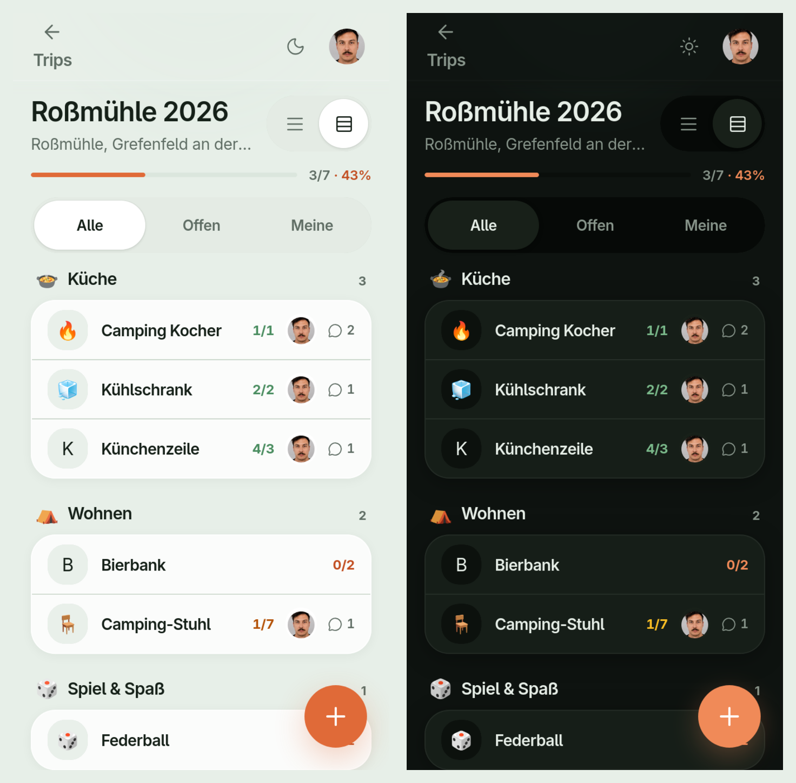

# Camping – Gemeinsam an alles denken

Geteilte Packliste für Freunde, die zusammen campen gehen: Wer braucht was, wer bringt’s mit — live synchronisiert, nichts doppelt, nichts vergessen.



## Features

- **Trips** anlegen und auswählen (Jahr, Ort, optional Zeitraum)
- **Packliste** mit Kategorien (Küche, Wohnen, Spiel & Spaß, Sonstiges)
- **Bedarf + Zusagen** — Items anlegen, sich als Mitbringer eintragen (inkl. Anzahl)
- **Live-Sync** über InstantDB (kein eigener Backend-Server)
- **Kommentare** pro Item
- **Profil** mit Name und optionalem Profilbild
- **Magic-Code-Login** per E-Mail (passwortlos)
- **Dark Mode** und Homescreen-Installation (PWA)

## Tech Stack

| | |
| --- | --- |
| App | [SvelteKit](https://svelte.dev/docs/kit) · Svelte 5 · TypeScript |
| UI | [Tailwind CSS](https://tailwindcss.com/) 4 · [Lucide](https://lucide.dev/) |
| Backend | [InstantDB](https://www.instantdb.com/) (Auth, Realtime, Storage) |
| Deploy | Vercel, Cloudflare Pages oder jeder Node-/Static-Host |

## Voraussetzungen

- Node.js 20+ (empfohlen)
- Kostenloser InstantDB-Account

## Quick Start

```sh
git clone git@github.com:realM1lF/camping-list-webapp.git
cd camping-list-webapp
cp .env.example .env
```

1. App unter [instantdb.com/dash](https://www.instantdb.com/dash) anlegen und die **App-ID** in `.env` eintragen:

   ```env
   VITE_INSTANT_APP_ID=your-app-id
   ```

2. Schema und Berechtigungen pushen (u. a. `$files` für Profilbilder):

   ```sh
   npx instant-cli login
   npx instant-cli push schema
   npx instant-cli push perms
   ```

3. App starten:

   ```sh
   npm install
   npm run dev
   ```

Dev-Server: [http://localhost:5173](http://localhost:5173)

## Scripts

| Befehl | Beschreibung |
| --- | --- |
| `npm run dev` | Dev-Server |
| `npm run build` | Produktions-Build |
| `npm run preview` | Build lokal prüfen |
| `npm run check` | TypeScript / Svelte-Check |
| `npm run lint` | Prettier + ESLint |
| `npm run format` | Code formatieren |

## Projektstruktur

```
src/
  lib/
    db/           # InstantDB-Client, Store, Repository (einzige Datenschicht)
    data/         # Kategorien, Emoji-Auswahl
    components/   # UI (shell/, list/, detail/)
    motion/       # Springs, Haptics (Sheet-Gesten)
  routes/
    +page.svelte          # Trip-Übersicht
    trip/[id]/+page.svelte # Packliste
instant.schema.ts         # InstantDB-Schema (CLI)
instant.perms.ts          # InstantDB-Berechtigungen (CLI)
docs/superpowers/specs/   # Fachliche Specs
```

## Umgebungsvariablen

| Variable | Beschreibung |
| --- | --- |
| `VITE_INSTANT_APP_ID` | App-ID aus dem InstantDB-Dashboard |

Vorlage: [`.env.example`](.env.example) — `.env` nicht committen.

## Deployment

1. `VITE_INSTANT_APP_ID` als Environment-Variable beim Host setzen.
2. Schema/Perms einmalig per Instant-CLI gegen die Produktions-App pushen (falls eigene App).
3. `npm run build` — Adapter: `@sveltejs/adapter-auto` (Vercel / Cloudflare / Node je nach Umgebung).

## Lizenz

[MIT](LICENSE) © 2026 Sebastian Schwerdhoefer
